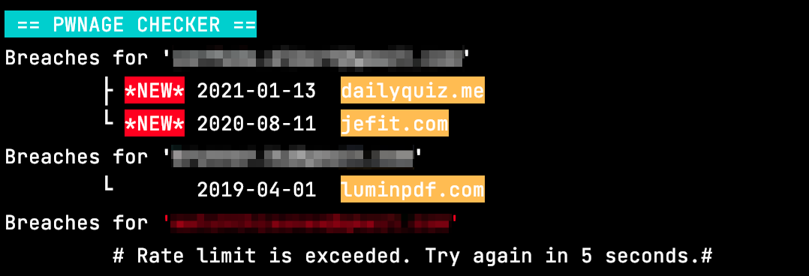

# pwned emails checker
\
\
Simple script that checks through the [haveineepwned API](https://haveibeenpwned.com) if any provided email accounts have been compromised in a data breach.

## Config file
*config.js*
```javascript
const settings = {
    email_check : [
        "example1@example.com",
        "example2@example.com",
    ],

    suppress_empty : true,
    suppress_error : false,

    new_alert_days: 31,

    // Your haveibeenpwned.com API key.
    API_KEY: "XXXXXXXXXXXXXXXXXXXXXXXX"
}
```
**email_check**\
Array containing the accounts to check breaches for

**new_alert_days**\
Shows `*NEW*` alert on breach if it was added less than X days ago.

**suppress_empty**\
Doesn't print "Breaches for XXX" if there arent any breaches

**suppress_errors**\
Doesn't print "Breaches for XXX" if the request returns an error

## API key
Starting from **haveibeenpwned API v3** the API key is not freely obtainable anymore.
You can purchase one [here](https://haveibeenpwned.com/API/Key)

## Running the script :rocket:
You can run the script with npm
```bash
npm start --silent
```
